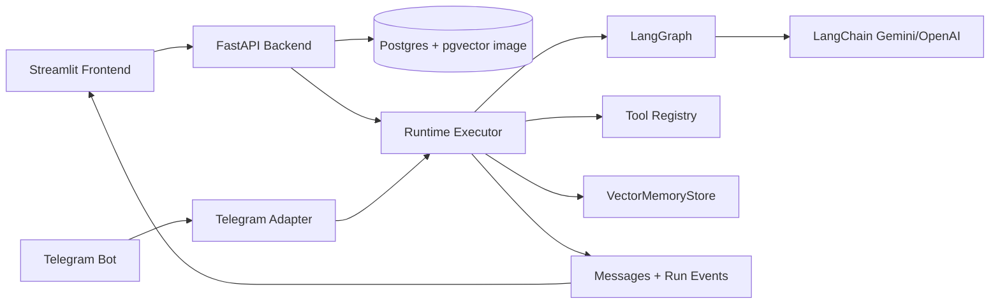

# AI Agent Orchestration Platform

Python implemnetation for the Yuno AI Engineer challenge. This service lets users create agents, instantiate multi-agent workflow templates, execute LangGraph workflows, persist message history, use memory, and trigger a workflow from Telegram.

## Quick Start

Run the full app with one command:

```bash
./scripts/start.sh
```

The script creates `.env` from `.env.example` if needed and starts Docker Compose.

URLs:

```text
Frontend: http://localhost:8501
Backend API: http://localhost:8000
API docs: http://localhost:8000/docs
```

Please add your credentials in `.env` for LLM and telegram:

```text
GOOGLE_API_KEY=...
TELEGRAM_BOT_TOKEN=...
```

## Architecture



## Runtime Choices

I used **LangGraph** because the challenge requires configurable multi-agent orchestration, not just a chat wrapper. LangGraph makes it easy to create workflow from agents, it can use JSON to create graph nodes, edges, and state making the backend persists messages, events, tokens and memory.

For LLM I have used LangChain wrappers, specifically Gemini is the default model provider but can be switched to other supported llms, given we have API keys.

I used streamlit for UI development as it is quick for demo setups and easy to configure with python support.

I have used fastembed for semantic embedding as it quick to build and runtime is also low, sentence transformer increases docker build time. In a real production scenario we can use sentence-transformers or 3rd party services.

## Components develeoped

- Streamlit web UI for agents, workflows, runs, memory, tools, and Telegram setup.
- FastAPI backend with clear API endpoints.
- PostgreSQL with pgvector with docker image for local setup.
- Local semantic embeddings through fastembed (quick to build and fast for demo).
- LangGraph with async workflow execution.
- Agent-to-agent message persistence visible in the UI.
- Tool registry: `web_search`, `calculator`, `current_time`, and `text_stats`.
- Two sample workflow templates: Research + Writer and Telegram Support Triage.
- Telegram connector with polling and inbound endpoint support.

## Creating Agents

Use the Streamlit Agents page or call the API:

```bash
curl -X POST http://localhost:8000/agents \
  -H "Content-Type: application/json" \
  -d '{
    "name": "Research Agent",
    "role": "researcher",
    "system_prompt": "Research concise facts and pass them to the next agent.",
    "model": "",
    "tools": ["memory", "web_search"],
    "channels": [],
    "limits": {"max_iterations": 2},
    "memory_settings": {"enabled": true, "scope": "workflow"},
    "guardrails": {"no_secrets": true}
  }'
```

Leave `model` blank to use `DEFAULT_MODEL`. The UI tool selector is populated from `GET /tools`.

## Running Workflows

Instantiate a template:

```bash
curl -X POST http://localhost:8000/templates/research-writer/instantiate \
  -H "Content-Type: application/json" \
  -d '{"name":"Demo Research Workflow"}'
```

Run it:

```bash
curl -X POST http://localhost:8000/workflows/<workflow_id>/runs \
  -H "Content-Type: application/json" \
  -d '{"input":"Compare pgvector and Qdrant for agent memory.","user_id":"demo-user","execute_async":false}'
```

Inspect:

```bash
curl http://localhost:8000/runs/<run_id>
curl http://localhost:8000/runs/<run_id>/messages
curl http://localhost:8000/runs/<run_id>/events
```

## Adding Workflow Templates

Add templates in `backend/app/templates/catalog.py`.

1. Add a `WorkflowTemplate` entry.
2. Create default agents with roles, prompts, tools, time limits and memory support.
3. Create a `Workflow` definition with `start_node`, `nodes`, and `edges`.
4. Use `agent` nodes for agents and `tool` nodes for tool execution.
5. Wire feedback loops with edge conditions such as `critic_needs_revision` and `critic_approved`.

Example tool node:

```json
{
  "id": "calculate",
  "type": "tool",
  "tool_name": "calculator",
  "input": {"expression": "(2 + 3) * 4"}
}
```

## Messaging Channels

Telegram is the supported external channel.

To connect Telegram:

1. Create a bot with BotFather and put the token in `.env` as `TELEGRAM_BOT_TOKEN`.
2. Start the app with `./scripts/start.sh`.
3. Instantiate or create a workflow.
4. Connect the workflow in the Streamlit Telegram page or call:

```bash
curl -X POST http://localhost:8000/channels/telegram/connect \
  -H "Content-Type: application/json" \
  -d '{"channel":"telegram","name":"Telegram Bot","default_workflow_id":"<workflow_id>"}'
```

The backend polling service will receive Telegram messages and route them to the connected workflow. For webhook-style integrations, send Telegram updates to `POST /channels/telegram/inbound`.

To add another channel, create an adapter in `backend/app/channels/`, store config in `ChannelBinding`, add routes in `backend/app/api/channels.py`, and convert inbound messages into workflow runs through `RuntimeExecutor`.

## Project Docs

- Backend details: [backend/README.md](backend/README.md)
- Frontend details: [frontend/README.md](frontend/README.md)

## Tests

```bash
python3.11 -m venv .venv
source .venv/bin/activate
pip install -e ".[dev]"
pytest
```
